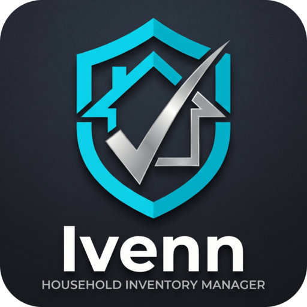
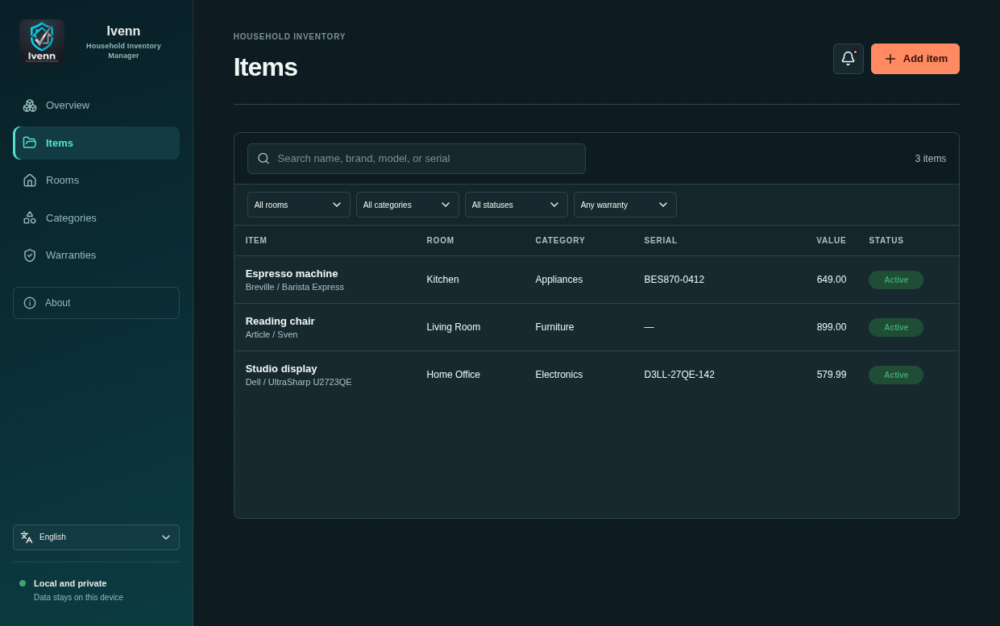

<p align="center">
	
</p>

# Ivenn Inventory Vault

Ivenn is a private, desktop-first household inventory and warranty tracker for recording possessions, receipts, serial numbers, and replacement values. It helps households prepare insurance-ready exports and avoid missed warranty expirations.

<p align="center">
	
</p>

## Features

- Inventory and room/category management
- Search and filtering by room, category, warranty state, and text
- Attachment uploads for receipts, item photos, and warranty documents
- Local receipt OCR suggestions during item creation, with review before applying values
- Warranty creation and upcoming-expiry tracking
- CSV and PDF inventory exports
- Persistent in-app warranty reminders

## Technology

| Area | Tools |
| --- | --- |
| Desktop client | Tauri 2, React, TypeScript, Vite |
| Local API | FastAPI, Pydantic, Uvicorn |
| Data | SQLite, SQLAlchemy, Alembic |
| Packaging | PyInstaller sidecar and Tauri native bundles |
| Receipt scanning | Tesseract OCR and Pillow |

## For Users

### Quick Install

Download the installer for your platform from [releases](https://github.com/px-pole/Ivenn-Household-Inventory-Manager/releases):

- **Windows:** Run the `.exe` installer — WebView2 is usually pre-installed on modern Windows
- **macOS:** Open the `.dmg` file and drag Ivenn to Applications
- **Linux:** Download the `.AppImage` and mark it executable, or use your distro's package manager

#### Linux System Dependencies

Ivenn requires WebKitGTK to run. Install it once:

```bash
# Debian/Ubuntu
sudo apt-get install libwebkit2gtk-4.1-0

# Fedora/RHEL
sudo dnf install webkit2gtk4.1

# Arch Linux
sudo pacman -S webkit2gtk-4.1
```

Receipt scanning (OCR) is optional; it requires Tesseract:

```bash
# Debian/Ubuntu
sudo apt-get install tesseract-ocr

# Fedora/RHEL
sudo dnf install tesseract

# Arch Linux
sudo pacman -S tesseract
```

**Auto-updates:** Ivenn checks for new versions at startup and notifies you. Updates are downloaded in the background and installed the next time you restart.

## For Developers

### Local API Setup

```bash
cp .env.example .env
python -m venv .venv
source .venv/bin/activate
pip install -e ".[dev]"
uvicorn app.main:app --reload
```

The app is available at `http://localhost:8001` by default. If port 8000 is already in use locally, the Docker setup will automatically use `APP_PORT` from `.env` or fall back to 8001.

## Database setup

```bash
alembic upgrade head
```

## Run tests

```bash
pytest -q
```

Before opening a pull request, also run:

```bash
npm --prefix desktop run lint
npm --prefix desktop run build
```

## Contributing

Contributions to the API, desktop client, translations, documentation, accessibility, tests, and native packaging are welcome. See [CONTRIBUTING.md](CONTRIBUTING.md) for platform setup, required checks, and pull-request guidance. For security or data-loss reports, read [SECURITY.md](SECURITY.md).

## Documentation

- [CONTRIBUTING.md](CONTRIBUTING.md) — Developer setup and contribution guidelines
- [docs/client-api.md](docs/client-api.md) — REST API documentation
- [docs/RELEASE.md](docs/RELEASE.md) — Release process and versioning
- [docs/code-signing.md](docs/code-signing.md) — Code signing for Windows and macOS
- [docs/auto-update.md](docs/auto-update.md) — Update mechanism configuration
- [SECURITY.md](SECURITY.md) — Security and data-loss reporting

## License

Ivenn Inventory Vault is available under the [MIT License](LICENSE).

## Docker setup

```bash
docker compose up --build
```

## Building from Source

The Tauri desktop client supports Windows, Linux, and macOS. Release packages must be built on their target operating system because PyInstaller and Tauri produce native binaries.

### Developer Platform Prerequisites

- **Windows:** Python 3.13+, Node.js 24+, Rust stable, Microsoft C++ Build Tools, and WebView2
- **macOS:** Python 3.13+, Node.js 24+, Rust stable, and Xcode Command Line Tools
- **Linux:** Python 3.13+, Node.js 24+, Rust stable, WebKitGTK 4.1, and standard build tools

For platform-specific setup instructions, see [CONTRIBUTING.md](CONTRIBUTING.md).

### Development Server

Launch the development build with auto-reload:

```bash
cd desktop
npm install
npm run tauri dev
```

Tauri starts FastAPI automatically on a private local port, applies database migrations, and stops the service when the desktop app closes. Desktop data is stored under the operating system's application-data directory; on Linux this defaults to `~/.local/share/com.inventoryvault.desktop/`.

The Data & Exports view saves CSV and PDF reports through a native system dialog. It also creates a complete ZIP backup containing a consistent SQLite snapshot, manifest checksums, and every uploaded attachment. Restore validates the backup, restarts the app, and replaces local data before the backend opens SQLite, avoiding file-lock problems on Windows.

### Building for Release

The Python backend is bundled as a standalone sidecar, so running the compiled application does not require Python or the repository `.venv`. To build a release:

```bash
pip install -e ".[dev]"
cd desktop
npm run tauri build
```

Build outputs use the native format for the current platform: Windows installers (`.exe`), macOS app bundles/DMG, and Linux AppImage. Linux AppImages are written under `desktop/src-tauri/target/release/bundle/appimage/`.

Builds are created automatically by CI/CD when you push a version tag (e.g., `git tag v0.2.0 && git push --tags`). Artifacts are attached to the GitHub release and signed where supported.

### Notes on Features

Tesseract and English language data enable local receipt scanning. The inventory, attachments, and manual editing features continue to work when OCR is unavailable.

Warranty reminders appear only inside Inventory Vault. The app does not request operating-system notification permission or send reminder data to an external notification service.

The stable client-facing API is available under `/api/v1`. See [docs/client-api.md](docs/client-api.md) for attachment upload, receipt extraction, and confirmation behavior.

## Production notes

- Local development runs in a no-auth mode for convenience.
- Set `REQUIRE_AUTHENTICATION=true` when enabling a real user-bound deployment.
- The app runs migrations automatically through the Docker entrypoint before starting Uvicorn.

